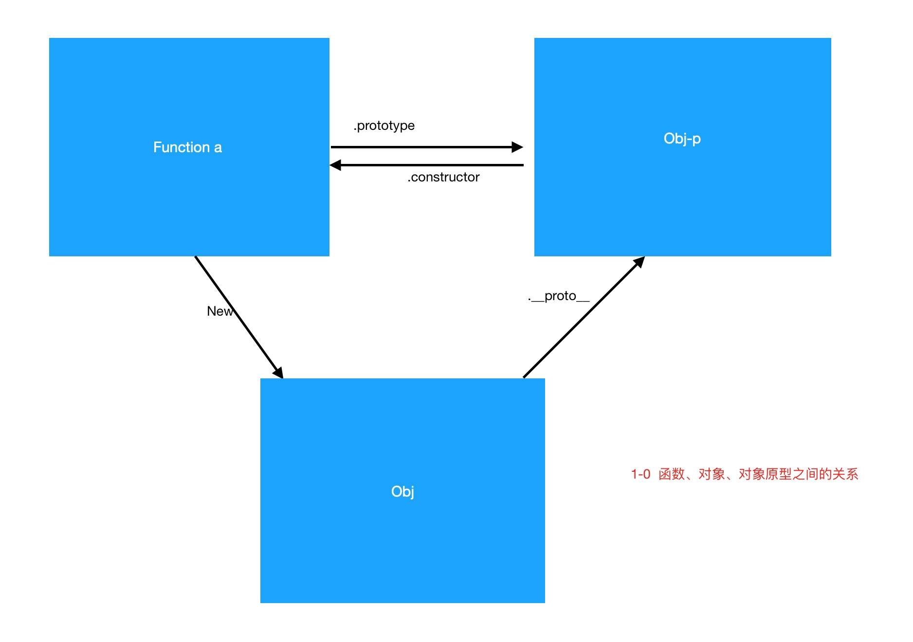

# 函数的实例化=>组件的闭标签

## 函数与函数的实例化对象
//什么是函数  与对象的关系
//函数、实例、原型


```js
    function f(){
        this.a = 1;
    }
    const obj = new f();
    //obj
    //原型链与对象的原型
    const objP = obj.__proto__;// 关于__proto__
    //objP
    //总结 
```




### dom的本质=>dom标签与dom对象


### 小程序||Vue的组件与闭标签  
```js
    //wx小程序
    Component({
        options: {
        multipleSlots: true // 在组件定义时的选项中启用多slot支持
        },
        properties: { /* ... */ },
        methods: { /* ... */ }
    })

```

## class
```js
    class a{}   
    typeof a    // "function" 
    a instaceof Function  // true   why?=>关于 typeof 与 instanceof
```

## react组件与组件的闭标签


### 组件的闭标签

//to 1-0.demo.js

```js
    
```